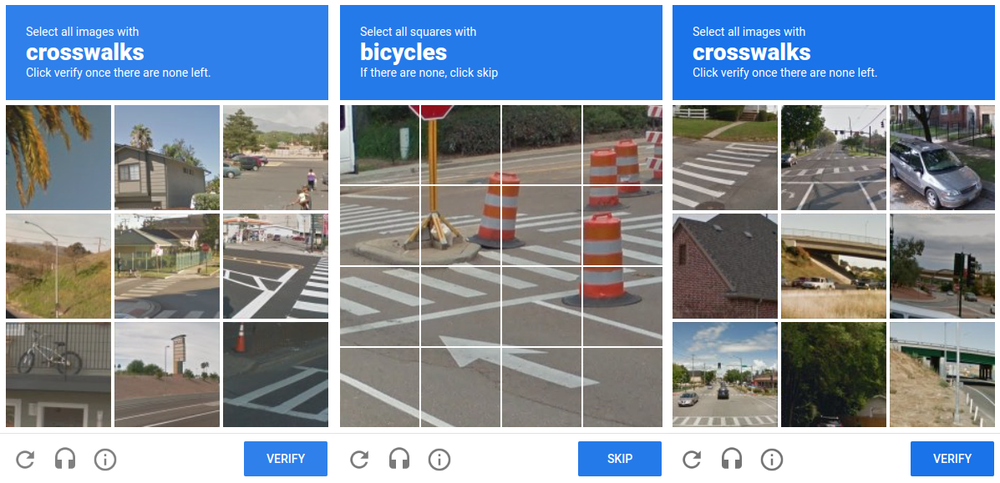
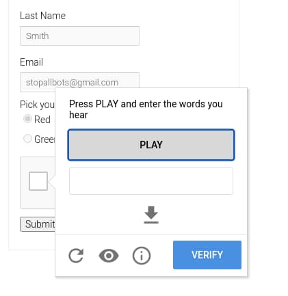
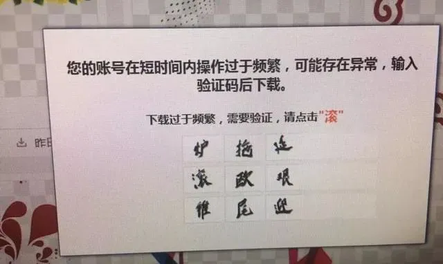
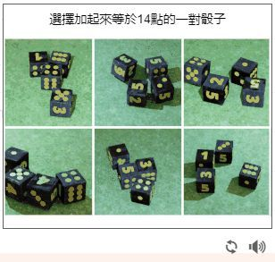
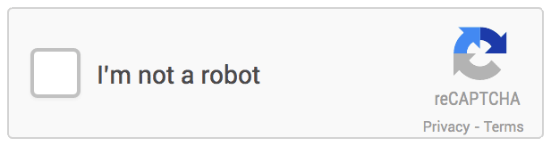

+++
title = '常见验证码及其解决方案'
date = 2019-10-14T17:15:38+08:00

+++

# 常见验证码及其解决方案

## 文本验证码

这是最常见的验证码类型，通常由扭曲的字母和数字组成，用户需准确输入这些字符才能通过验证。

### 示例
  

### 解决方案
这类验证码使用CNN即可较好的识别，但需要大量准确的标注集做训练。
取巧的办法是收集常见的验证码生成库样式图片，判断目标网站使用的字符验证码是否是开源库，如果是开源库则使用对应库批量生成标注集。

## 图像识别验证码
用户需要从一系列图像中选择符合特定主题的图片，例如识别包含交通工具的图片或者点选文字。

### 示例
 

### 解决方案
此类点选验证码，可以采用yolo框架进行对象识别或文字区域提取。

## 音频验证码
为视觉障碍者设计的验证码形式，用户需听取一段音频并输入其中的数字或字母。

### 示例

### 解决方案
可以采用各大开放平台的语音识别接口，如Google speech或wit进行识别。

## 逻辑问题
用户需要回答一个简单的数学问题或逻辑问题。

### 示例
  

### 解决方案
此类验证码难易分级太大，复杂如上图形式，简单则是简单的数学加减法运算。解决难点主要在内容提取到答案的转换。

## 滑块验证码

用户需将滑块拖动到特定位置，通常是为了完成一张图片的拼图。
### 示例
  

### 解决方案
此类验证码识主要突破点在于缺口识别，有限图片集可以通过图片采集+opencv做图像运算来获取，效率高但限制多。也可采用yolov3等框架进行标注训练，优点是泛化性能较好，缺点是成本较高，需要大量算力及标注时间。

## 行为分析验证码
这种类型的验证码通过分析用户的行为（如鼠标移动、点击模式等）来判断是否为机器人。
### 示例
 

### 解决方案
此类验证码突破难点在于逆向前端或sdk库的逻辑，需要识别出验证接口验证参数生成逻辑，使用算法生成行为轨迹进行加密并校验。

## 二步验证
除了传统的验证码外，用户还需要输入从其他设备（如手机应用）接收到的一次性密码。

### 解决方案
邮箱校验类型可以使用程序构建邮箱接码池，而手机接码也可以自建猫池或使用接码平台进行打码，如果是手机应用接码，则需要在手机上开发对应应用或xposed插件进行自动获取。