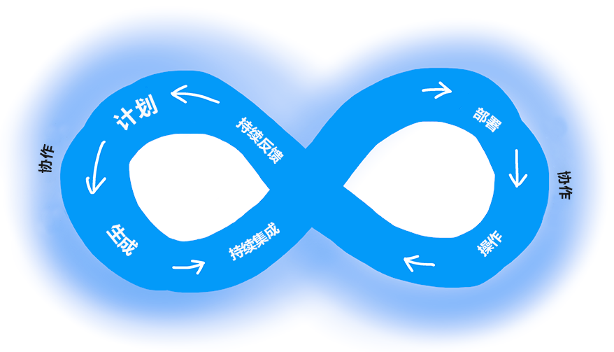
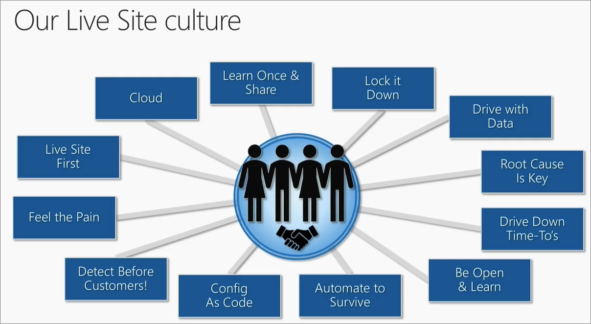
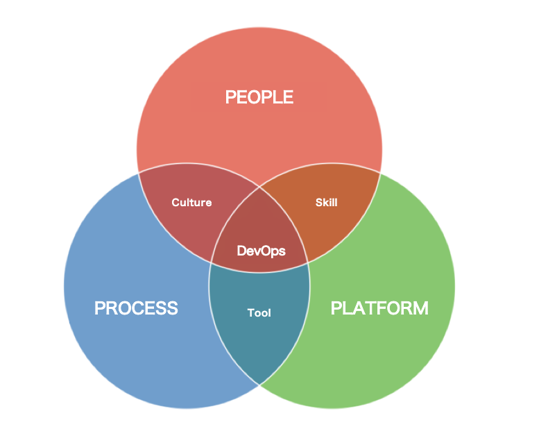
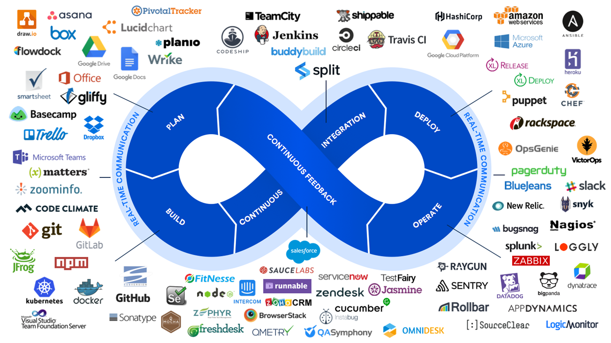
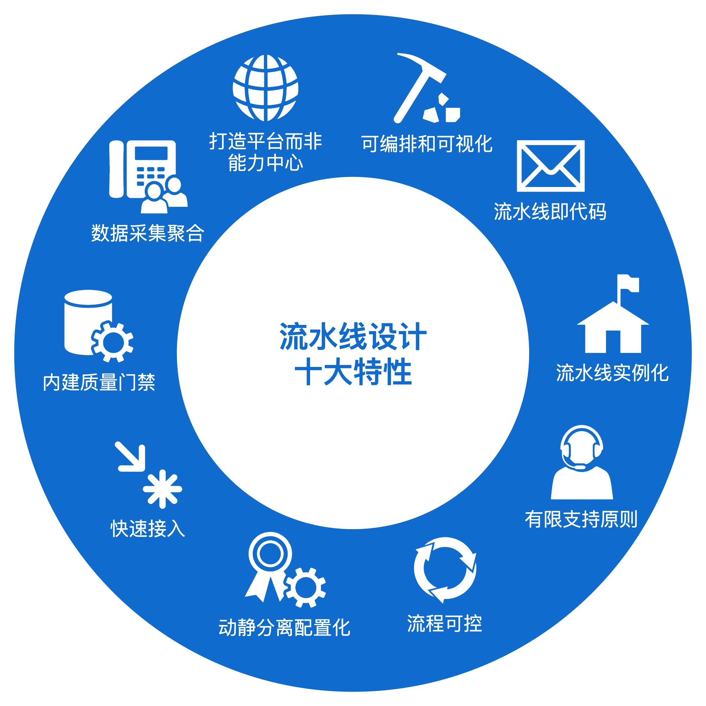

+++
title = 'DevOps学习整理'
date = 2021-10-07T13:38:50+08:00

+++

# DevOps学习整理
> “DevOps 是人员、流程和产品的集合体现，它可让我们向最终用户持续交付价值。” 
> --Donovan Brown 

> DevOps（开发 Development 与运维 Operations 的组合词）是一种文化、一场运动或实践，强调在自动化软件交付流程及基础设施变更过程中，软件开发人员与其他信息技术（IT）专业人员彼此之间的协作与沟通。它旨在建立一种文化与环境，使构建、测试、软件发布得以快速、频繁以及更加稳定地进行。
> --Wiki

## 软件工程三种模式

### 瀑布式开发模式
瀑布式开发模式是一种按照需求、设计、开发、测试和部署的顺序进行软件开发的模式，每个阶段都要经过严格的评审和验证，才能进入下一个阶段。
瀑布式开发模式将软件交付过程划分成几个阶段，从需求到开发、测试和运维，它的理念是软件开发的规模越来越大，必须以一种工程管理的方式来定义每个阶段，以及相应的交付产物和交付标准，以期通过一种重流程，重管控，按照计划一步步推进整个项目的交付过程。
这种模式适用于需求明确、稳定和可预测的项目，但不适应市场和用户需求的快速变化

* **优点**：可以对不同阶段的质量和成本进行严格把控，便于人员间的分工协作，提供了软件开发的基本框架。
* **缺点**：不适应市场和用户需求的快速变化，无法及时获取反馈和改进，风险较高，缺乏灵活性和创新性

### 敏捷开发模式
敏捷开发模式是一种以用户需求为核心，采用迭代、循序渐进的方式进行软件开发的模式，每次迭代都会交付可工作的软件，并根据用户反馈进行改进。
敏捷的核心理念是，既然我们无法充分了解用户的真实需求是怎样的，那么不如将一个大的目标不断拆解，把它变成一个个可交付的小目标，然后通过不断迭代，以小步快跑的方式持续开发。
这种模式适用于需求不明确、创新性或需要抢占市场的项目，可以提高软件的质量和效率。

* **优点**：可以以用户需求为核心，采用迭代、循序渐进的方式进行软件开发，每次迭代都会交付可工作的软件，并根据用户反馈进行改进，提高软件的质量和效率。
* **缺点**：需要高度的协作和沟通，对人员的素质和能力要求较高，文档和测试相对较少，可能导致软件的可维护性和可扩展性降低。

### DevOps模式
DevOps模式是一种将开发和运维紧密结合的软件开发模式，通过自动化的工具和流程，实现软件的快速交付和持续改进。

这种模式强调开发和运维的协作、沟通和反馈，以及持续学习和改进的文化，可以提高软件的可靠性和可用性。

让我们从有关软件开发的基本假设着手。 使用 OODA（观察、察觉、决策和行动）周期来描述它。 OODA 循环最初旨在确保试点成功，现在已成为领先于竞争对手的绝佳办法。 首先观察和了解业务、市场、需求、当前用户行为和提供的遥测数据。 然后，通过确定可以提供的选择（可能包含试验）来调整和定位。 接下来，决定要追求的目标，并通过向实际用户提供工作软件来实现。 你会看到这一切都具有周期性。

OODA周期的四个步骤分别是：
* 观察（Observe）：观察和收集信息，形成对外部环境或问题的初始认知。
* 察觉（Orient）：将观察到的信息与已有的知识结合，形成自己的认知框架和理解。
* 决策（Decide）：根据自己的认知和情况分析做出决策。
* 行动（Act）：执行决策，采取具体行动，反馈和修正错误，并持续观察新的变化和信息。

OODA周期的核心是快速适应和应对，通过加快自己的决策速度，干扰和打断对手的决策循环，从而获取竞争优势。OODA周期在很多领域都有应用，比如无人驾驶、AI产品、战略管理等。

而DevOps 是通过平台（Platform）、流程（Process）和人（People）的有机整合，以 C（协作）A（自动化）L（精益）M（度量）S（共享）文化为指引，建立一种可以快速交付价值并且具有持续改进能力的现代化 IT 组织，可有效地缩短OODA周期。

* **优点**：可以将开发和运维紧密结合，通过自动化的工具和流程，实现软件的快速交付和持续改进，提高软件的可靠性和可用性。
* **缺点**：需要在原有的文化和流程上进行大刀阔斧的变革，需要自上而下的力量进行推动，需要投入大量的时间和资源，可能遇到重重阻力和挑战。

## 为什么需要DevOps
* 加速上市时间
通过提高效率、改进团队协作、自动化工具和持续部署，团队能快速减少从产品启动到市场推出的时间。
* 适应市场和竞争

* 保持系统稳定性和可靠性
通过采用持续改进做法，团队能增强所部署产品和服务的稳定性和可靠性。 这些做法有助于减少故障和风险。
* 缩短平均恢复时间
平均恢复时间指标表示从故障或漏洞中恢复所用的时间。 若要管理软件故障、安全漏洞和持续改进计划，团队应度量并努力改进此指标。

### 主要目的：高效的软件交付
近年来在各大企业战略中曝光率最高的关键词，数字化转型绝对是排名最高的。软件慢慢从企业内部的支撑系统和成本中心，变成了企业服务的直接载体和利润中心。企业通过软件降低运营成本，提升服务水平，而用户在获得便利的同时，也加强了同企业之间的联系。
但我们所身处的是一个VUCA的时代，VUCA 是指易变性（Volatility）、不确定性（Uncertainty）、复杂性（Complexity）和模糊性（Ambiguity），它代表了这个时代的典型特征。企业能快速满足用户的需求，在行业大势之下灵活转身，在跨界打击越发普遍的情况下脱颖而出，已经不仅仅是 good to have 的能力，而是 must have 的能力。所以说，软件交付的效率和质量成了当今企业的核心价值和核心竞争力。

实施 DevOps 带给企业的价值可以参考 DevOps 业内非常著名的现状调查报告。

DevOps 比较重要 的 4 个结果指标：
1. 部署频率：指应用和服务向生产环境部署代码的频率。
2. 变更前置时间：指代码从提交到成功运行在生产环境的时长。
3. 服务恢复时间：指线上应用和服务出现故障到恢复运行的时长。
4. 变更失败率：指应用和服务在生产环境部署失败或者部署后导致服务降级的比例。

从2018的数据来看，与低效能团队相比，高效能团队的部署频率高了 46 倍，变更前置时间快了 2500 多倍，服务恢复时间也快了 2600 多倍，失败率低了 7 倍。
DevOps 状态报告中提到的四项结果指标，分别代表了软件交付的两个最重要的方面，也就是交付效率和交付质量。

### 额外收获：激发团队创造力

熟悉云计算的同学可能或多或少地了解过容器编排领域的事实标准 Kubernetes 以及它背后的 CNCF 基金会，那么，企业为什么热衷于加入这样的基金会呢？即使要付出一笔不菲的费用也在所不惜，企业这么做的收益究竟是什么？

通常来讲，企业加入这样的组织，也是为了向内部员工表态，我们正和世界上最著名的公司站在同一条起跑线上，关注着同样的问题。这对他们的员工来说，既能起到激励作用，也能增强对企业自身的信心。

而对于 DevOps 而言，道理也是同样的，因为说到底，企业的问题都是人的问题，最核心的价值最终都会归结到人身上，所以，单纯关注软件交付的能力而忽视人的感受，结果往往都是片面的。

在企业内部建设 DevOps 工具平台的时候，我也经常在思考这个问题，我们费尽心思通过平台能力建设提升了 5% 的交付效率，即便节省下来的时间只是让员工多休息了一会儿，也是非常有意义的事情。因为DevOps 本身也包含了改善软件从业人员的生存状态，提升他们的幸福水平的理念。

这么看来，实施 DevOps，一方面可以通过种种流程优化和自动化能力，改善软件开发团队的工作节奏，另一方面，也可以让大家关注同一个目标，彼此信任，高效协作，调动员工的积极性和创新能力，从而让整个团队进入一种积极创造价值的状态，而这所带来的影响远非建设一两个工具平台可比拟的。

## DevOps文化与工具
若要完全实现 DevOps，必须采用 DevOps 文化。 培养 DevOps 文化需要深入改变人们的工作和协作方式。 当组织践行 DevOps 文化时，可创造一个有利于高绩效团队不断成长的环境。 虽然采用 DevOps 做法可通过技术来自动执行和优化流程，但若无法在组织和人员中实现 DevOps 文化转型，就无法享受到 DevOps 的全部优势。

以下做法是 DevOps 文化的关键组成部分：
* 协作、可见性和一致性：健康 DevOps 文化的标志体现在团队之间的协作。 协作从可见性开始。 开发、IT 和其他团队应相互共享其 DevOps 流程、优先事项和关注点。 通过共同规划工作，他们能更好地在与业务相关的目标和成功措施上保持一致。
* 范围和问责方面的转变：当各个团队保持一致时，他们会掌握所有权并参与其他生命周期阶段，而不仅仅是与他们的角色对应的阶段。 例如，开发人员不仅要对开发阶段的创新和质量负责，还要对他们的改变在运营阶段带来的性能和稳定性负责。 同时，IT 操作员一定要在规划和开发阶段中包括治理、安全性和符合性。
* 更短的发布周期：DevOps 团队通过短周期发布软件来保持敏捷。 因为进度是渐进式的，缩短发布周期可以让计划和风险管理更容易，同时也减少了对系统稳定性的影响。 缩短发布周期还可以让组织适应和应对不断变化的客户需求和竞争压力。
* 持续学习：高绩效的 DevOps 团队会形成一种成长思维。 他们会快速失败并将学习融入其流程中。 他们会努力不断提高、提升客户满意度，同时加快创新和市场适应能力。

DevOps 中的文化和工具，本身就是一体两面，我们既不能盲目地奉行工具决定论，上来就大干快干地采购和建设工具，也不能盲目地空谈文化，在内部形成一种脱离实际的风气。
因此，对 DevOps 工具和文化的体系化认知，可以归纳到 DevOps 的 3 个支柱之中，即人（People）、流程（Process）和平台（Platform）。
如下图：

* 人 + 流程 = 文化
* 流程 + 平台 = 工具
* 平台 + 人 = 培训赋能
这 3 个支柱缺一不可，只有通过人、流程和平台的有机结合，在文化、工具和人员培训赋能领域共同推进，才能实现 DevOps 的真正落地实施。

## 实现 DevOps 做法
在整个应用程序生命周期中，通过遵循 DevOps 做法（以下各节中所述）来实现 DevOps。 其中一些做法有助于加速、自动化和改进特定阶段。 其他的跨越几个阶段，帮助团队创建可帮助提高生产效率的无缝进程。

### 持续集成和持续交付 (CI/CD)
持续集成 (CI) 是开发团队用于自动执行、合并和测试代码的做法。 CI 有助于在开发周期的早期发现 bug，从而降低 bug 修复成本。 自动测试作为 CI 过程的一部分执行以确保质量。 CI 系统生成工件并将其馈送给发布过程，以驱动频繁部署。

持续交付 (CD) 是生成、测试代码并将其部署到一个或多个测试和生产环境的过程。 在多个环境中进行部署和测试可提高质量。 CD 系统生成可部署的工件，包括基础结构和应用。 自动发布过程使用这些工件将新版本和修补程序发布到现有系统。 监视和发送警报的系统持续运行，以提高整个 CD 过程的可见性。

### 版本控制
版本控制是管理各版本中代码的做法，用于跟踪修订和更改历史记录，使代码易于评审和恢复。 通常使用版本控制系统（比如 Git）来实现此做法，而这些系统允许多个开发人员协作编写代码。 有关合并在相同文件中发生的代码更改、处理冲突以及将更改回滚到早期状态，这些系统具有一个清楚的流程。

使用版本控制是一个基本的 DevOps 做法，可帮助开发团队协同工作，在团队成员之间划分编码任务，并存储所有代码，以便在需要时轻松恢复。 版本控制也是其他做法（如持续集成和基础结构即代码）中的必要元素。

### 敏捷软件开发
敏捷是一种软件开发方法，它强调团队协作、客户和用户反馈，以及凭借短发布周期实现对变化的高度适应性。 采用 Agile 的团队向客户提供持续的更改和改进，收集他们的反馈，然后吸取经验并根据客户的需求和需要进行调整。 Agile 与其他更传统的框架（如瀑布框架）有本质的不同，瀑布框架包括由顺序阶段定义的较长的发布周期。 看板和 Scrum 是两种与 Agile 相关的热门框架。

### 基础结构即代码
基础结构即代码以一种描述性的方式定义系统资源和拓扑，团队可以像编码一样管理这些资源。 这些定义也可以存储并在版本控制系统中进行版本控制以及像代码一样进行评审和还原。

使用基础设施即代码有助于团队以可靠、可重复和可控的方式部署系统资源。 基础设施即代码也有助于自动化部署并降低人为错误的风险，特别是对于复杂的大型环境。 这种可重复、可靠的环境部署解决方案允许团队维护与生产环境相同的开发和测试环境。 将环境复制到不同的数据中心和云平台同样变得更加简单和高效。

### 配置管理
配置管理是指管理系统中资源的状态，包括服务器、虚拟机和数据库。 使用配置管理工具，团队能够以一种可控和系统的方式进行更改，因此降低了修改系统配置的风险。 团队使用配置管理工具来跟踪系统状态并帮助避免配置漂移，即避免系统资源的配置随时间偏离为其定义的目标状态。

通过与基础设施即代码结合使用，很容易对系统定义和配置进行模板化和自动化，从而帮助团队大规模地操作复杂的环境。

### 持续监视
持续监控意味着全面、实时地了解整个应用程序堆栈的性能和运行状况。 此可见性的范围涵盖从运行应用程序的基础基础结构到更高级别的软件组件。 可见性是通过收集遥测和元数据以及对需引起操作员注意的预定义条件的对应警报进行设置来实现的。 遥测包括从系统各个部分收集的事件数据和日志，这些数据和日志存储在可以分析和查询的地方。

高绩效的 DevOps 团队会确保他们设置了可操作且有意义的警报，并收集了丰富的遥测数据，以便能够从大量数据中获得见解。 这些见解有助于团队实时解决问题，并了解如何在未来的开发周期中改进应用程序。

### 规划
在规划阶段，DevOps 团队会构思、定义和描述他们计划构建的应用程序和系统的特性和功能。 团队会以低粒度和高粒度级别跟踪任务进度（从单一产品到多个产品组合）。 团队使用以下 DevOps 做法来规划敏捷性和可见性：
* 创建积压工作。
* 跟踪 bug。
* 使用 Scrum 管理敏捷软件开发。
* 使用看板面板。
* 使用仪表板来可视化进度。

### 开发
开发阶段包括开发软件代码的所有方面。 在此阶段，DevOps 团队会执行以下任务：

* 选择开发环境。
* 编写、测试、审查和集成代码。
* 将代码构建到项目中，从而部署到各种环境。
* 使用版本控制（通常为 Git）协作处理代码以及并行工作。

若要在不牺牲质量、稳定性和生产效率的情况下快速创新，DevOps 团队需：

* 使用高效工具。
* 自动执行常规和手动步骤。
* 通过自动化测试和持续集成 (CI) 以较小的增量进行迭代。

### 传送
交付是指：理想情况下，通过持续交付 (CD) 将应用程序一致且稳定地部署到生产环境的流程。

在交付阶段，DevOps 团队需：

* 定义具有明确手动审批阶段的发布管理流程。
* 设置自动入口，以便在各阶段之间移动应用程序，直到最终发布给客户。
* 自动执行交付流程，使其可缩放、可重复、受控且经过良好测试。

交付还包括部署和配置交付环境的基本基础结构。 DevOps 团队使用基础结构即代码 (IaC)、容器和微服务技术来提供完全受控的基础结构环境。

在影响客户体验之前，安全部署做法可识别问题。 这些做法可帮助 DevOps 团队轻松、自信、放心地频繁交付。

### 运营
运营阶段涉及在生产环境（包括混合云或公有云，例如 Azure）中维护、监视和排查应用程序。 DevOps 团队旨在实现系统可靠性、高可用性、出色的安全性和零停机时间。

自动化交付和安全部署做法可帮助团队在出现问题时快速识别和缓解问题。 保持警惕性需要丰富的遥测、可操作的警报以及全面了解应用程序和底层系统。

### Microsoft DevOps实践参考
有关 Microsoft 在公司软件团队中为支持 DevOps 规划而采用的若干教训和做法的概述，请参阅 (Microsoft 如何使用 DevOps 进行规划)[https://learn.microsoft.com/zh-cn/devops/plan/how-microsoft-plans-devops]。

有关 Microsoft 为支持其转向 DevOps 所用开发做法的概述，请参阅 (Microsoft 如何使用 DevOps)[https://learn.microsoft.com/zh-cn/devops/develop/how-microsoft-develops-devops] 进行开发。

有关 Microsoft 为提供高效的交付系统而不断发展的核心 DevOps 原则及流程的信息，请(参阅 Microsoft 如何使用 DevOps 交付软件)[https://learn.microsoft.com/zh-cn/devops/deliver/how-microsoft-delivers-devops]。

有关 Microsoft 用于运营复杂联机平台的做法，请参阅 (Microsoft 如何使用 DevOps 运营可靠的系统)[https://learn.microsoft.com/zh-cn/devops/operate/how-microsoft-operates-devops]。

## 如何选择工具链

由上图可以看出，DevOps各个阶段拥有非常多的工具可供选择。而对于小型团队和公司，我建议使用足够少的工具来覆盖DevOps整个“流水线”。以避免在工具上耗费太多时间，而忽略了DevOps本身的东西。
本节源自于在对DevOps相关内容学习以后，根据自身团队特点设计的一套方案，并成功落地。
在实施该方案前，团队部署一次脚本到生产环境大概需要两个小时左右，实施过后，依照实际网络情况，缩短到5分钟以内，大大降低了团队脚本更新发布效率，以及软件质量。使团队开发由过去的“慢且乱”变为后来的“快而准”。

我所实践的“DevOps”更准确的称呼应该是“GitOps”，它是“DevOps”的一种“实践”，GitOps 是一种持续交付的方式。它的核心思想是将应用系统的声明性基础架构和应用程序存放在 Git 版本库中。

将 Git 作为交付流水线的核心，每个开发人员都可以提交拉取请求（Pull Request）并使用 Git 来加速和简化 Kubernetes 的应用程序部署和运维任务。通过使用像 Git 这样的简单熟悉工具，开发人员可以更高效地将注意力集中在创建新功能而不是运维相关任务上（例如，应用系统安装、配置、迁移等）。

### 工具链
由于项目涉密等原因，无法是用公有云或公有服务相关的工具，所以下列工具中非特别注明的情况下，均为基于私有云平台自建的托管服务。

主要用到的工具有：
* Gitlab
* Gitlab runner
* precommit
* Ansible
* Promethus
* Grafana
* Harbor
* Helm
* K8s

#### 开发阶段
* `Gitlab`作为代码托管工具以及仓库权限管理
* `Gitlab Issues`作为任务发布以及错误追踪工具
* `precommit`工具格式化代码并进行本地测试运行

#### 测试阶段
* 配置`.gitlab-ci.yml`测试任务
* 使用`gitlab runner`对代码进行统一的格式化
* 使用`gitlab runner`运行测试用例运行并输出测试报告

#### 部署阶段
* 配置`.gitlab-ci.yml`部署任务
  * 使用`gitlab runner`运行`Ansible playbook`对目标环境进行检查，保障满足特定要求
  * 使用`gitlab runner`打包代码镜像并推送到`Harbor`
  * 使用`gitlab runner`更新helm的chart
  * 使用`gitlab runner`切换到指定k8s集群:`kubectl config`,并安装指定chart:`helm install`

#### 运维阶段
* 使用`Prometheus`+`Grafana`监控集群状态
* 使用`K8s`保障应用高可用
* 使用`Kubernetes Dashboard`监控`K8s`集群容器状态

### 持续交付平台：现代流水线设计十大特性

可以看出，我所实践的GitOps切合了流水线的十大特性，基于gitlab-ci/Ansible Playbook/K8s等提供的能力，实现了一个健壮的、可持续交付的流水线。