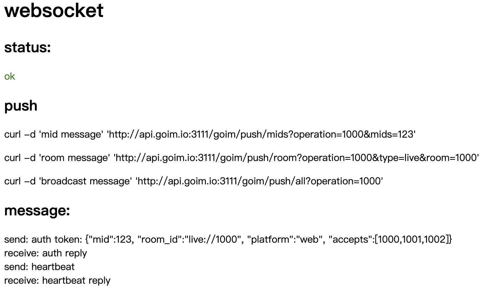
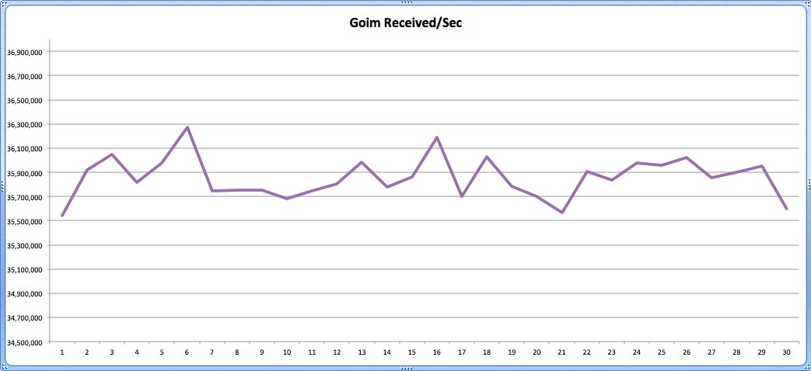
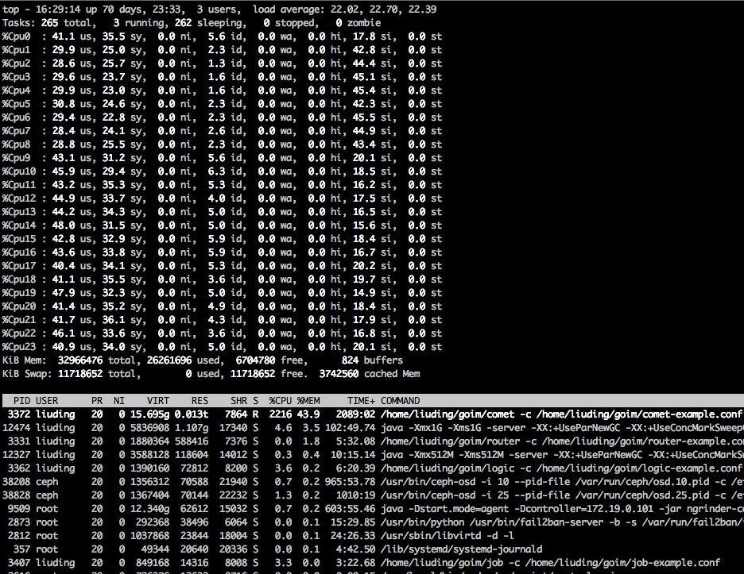
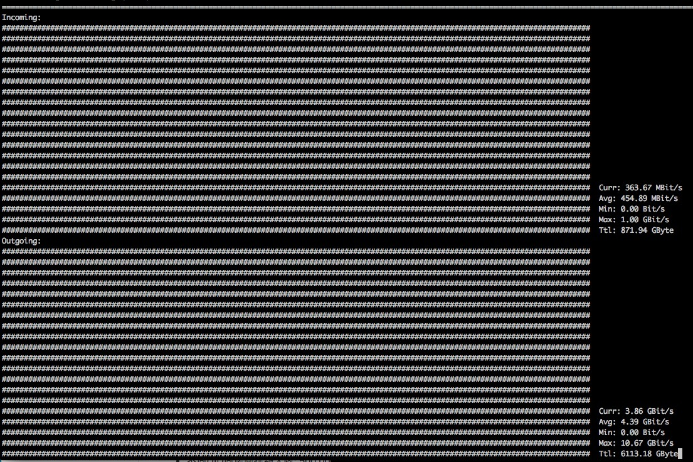
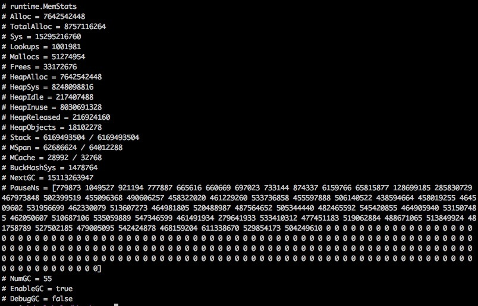

+++
title = '高并发实操：goim实验环境搭建'
date = 2023-11-30T19:07:46+08:00

+++

# 高并发实操：goim实验环境搭建
上一节大概梳理了goim中的架构及其部分组件的具体实现，接下来我将搭建一个goim实验环境，用于后续重构部分组件后的对比测试。
由于goim依赖kafka(做消息中间件)以及redis(做缓存映射)，因此需要安装两个依赖。
## 安装Kafka
### 下载并解压Kafka
```bash
$ tar -xzf kafka_2.13-3.6.0.tgz
$ cd kafka_2.13-3.6.0
```

### 启动Kafka环境
从Kafka2.8早期版本开始，Kafka开始支持KRaft(Kafka Raft)共识协议的版本。在Kafka3.3.1中，标识该版本在生产环境可用。因此，Kafka现在支持KRaft和Zookeeper两种方式启动。

#### 使用KRaft
1. **生成集群UUID**
   ```bash
   $ KAFKA_CLUSTER_ID="$(bin/kafka-storage.sh random-uuid)"
   ```

2. **设置日志目录格式**
   ```bash
   $ bin/kafka-storage.sh format -t $KAFKA_CLUSTER_ID -c config/kraft/server.properties
   ```

3. **启动Kafka服务器**
   ```bash
   $ bin/kafka-server-start.sh config/kraft/server.properties
   ```
到此，一个可用的kafka服务启动完毕。

#### 使用Zookeeper

1. **更新系统包列表**：
   ```bash
   sudo apt-get update
   ```

2. **安装 Java**（如果尚未安装）：
   ```bash
   sudo apt-get install default-jdk
   ```

3. **下载 ZooKeeper**：
   - 访问 [Apache ZooKeeper 官网](https://zookeeper.apache.org/releases.html) 获取最新稳定版本的下载链接。

4. **解压 ZooKeeper**：
   ```bash
   tar -xvf [下载的文件名]
   ```

5. **创建配置文件**：
   - 进入 ZooKeeper 目录，复制 `conf/zoo_sample.cfg` 为 `conf/zoo.cfg`：
     ```bash
     cd [ZooKeeper 目录]
     cp conf/zoo_sample.cfg conf/zoo.cfg
     ```

6. **启动 ZooKeeper**：
   ```bash
   $ bin/zookeeper-server-start.sh config/zookeeper.properties
   ```

7. **启动Kafka**
   转到Kafka目录
   ```bash
   $ bin/kafka-server-start.sh config/server.properties
   ```


### 测试Kafka
1. **创建 Topics**
   ```bash
   $ ./bin/kafka-topics.sh --create --topic quickstart-events --bootstrap-server localhost:9092
   Created topic quickstart-events.

   $ ./bin/kafka-topics.sh --describe --topic quickstart-events --bootstrap-server localhost:9092
   Topic: quickstart-events        TopicId: NPmZHyhbR9y00wMglMH2sg PartitionCount: 1       ReplicationFactor: 1	Configs:
    Topic: quickstart-events Partition: 0    Leader: 0   Replicas: 0 Isr: 0
   ```
2. **读取 Events**
   启动一个终端开始等待事件
   ```bash
   ./bin/kafka-console-consumer.sh --topic quickstart-events --from-beginning --bootstrap-server localhost:9092
   ```
3. **写入 Events**
   ```bash
   $ ./bin/kafka-console-producer.sh --topic quickstart-events --bootstrap-server localhost:9092
   This is my first event
   This is my second event
   ```
   此时，可以在读取终端看到发送的Events。

## 安装Redis

```bash
#更新包列表
sudo apt update
#安装redis
sudo apt install redis-server
```
修改配置文件`/etc/redis/redis.conf`，修改bind为本地路径或者绑定外网地址，以提供外部访问。


## 启动Discovery
bilibili/discovery是B站团队参考Netflix Eureka开发的一个服务发现AP系统。旨在实现以下目标：
1. 实现AP类型服务注册发现系统，在可用性极极极极强的情况下，努力保证数据最终一致性
2. 与公司k8s平台深度结合，注册打通、发布平滑、naming service等等
3. 网络闪断等异常情况，可自我保护，保证每个节点可用
4. 基于HTTP协议实现接口，简单易用，维护各流行语言SDK

相对Netflix Eureka的改进：
* 长轮询监听应用变更（Eureka定期30s拉取一次）
* 只拉取感兴趣的AppID实例（Eureka一拉就是全部，无法区分）
* 合并node之间的同步请求/(ㄒoㄒ)/~~其实还没实现，是个TODO
* Dashboard骚操作~
* 多注册中心信息同步支持
* 更完善的日志记录

### 配置一个单节点discovery

环境要求：`go1.21.x`(and later)

从源码编译可执行文件：
```bash
git clone https://github.com/bilibili/discovery.git
cd discovery/cmd/discovery
go build
```

创建配置文件`discovery.toml`
```toml
# 同一discovery集群的所有node节点地址，包含本node
nodes = ["127.0.0.1:7171"]

# 本可用区zone(一般指机房)标识
[env]
region = "sh"
zone = "sh001"
host = "test1"
DeployEnv = "dev"

# 其他可用区zone访问host和其标识
# [zones]
# "sh002" = ["10.2.0.10:7171", "10.2.0.11:7171", "10.2.0.12:7171"]
# "sh003" = ["10.3.0.10:7171", "10.3.0.11:7171", "10.3.0.12:7171"]

# 本节点监听端口
# 注意：ip别配置为0.0.0.0或者127.0.0.1
[httpServer]
addr = "127.0.0.1:7171"
timeout="40s"

# 当前节点同步其他节点使用的http client
# dial 连接建立超时时间
# keepAlive 连接复用保持时间
[httpClient]
dial = "1s"
keepAlive = "120s"
timeout="40s"

[log]
stdout = true
```
运行：
```bash
./discovery -conf discovery.toml
```


## 启动goim

### 组件服务启动
下载构建goim组件：comet/logic/job

```bash
git clone https://github.com/Terry-Mao/goim.git
cd goim
make build
```
如果机器上没有make工具，可以单独编译每个组件：
```bash
go build -o target/comet cmd/comet/main.go
go build -o target/logic cmd/logic/main.go
go build -o target/job cmd/job/main.go
```

配置各个组件：

comet.toml
```toml
# This is a TOML document. Boom
debug = true
[discovery]
    nodes = ["127.0.0.1:7171"]

[rpcServer]
    addr = ":3109"
    timeout = "1s"

[rpcClient]
    dial = "1s"
    timeout = "1s"

[tcp]
    bind = [":3101"]
    sndbuf = 4096
    rcvbuf = 4096
    keepalive = false
    reader = 32
    readBuf = 1024
    readBufSize = 8192
    writer = 32
    writeBuf = 1024
    writeBufSize = 8192

[websocket]
    bind = [":3102"]
    tlsOpen = false
    tlsBind = [":3103"]
    certFile = "../../cert.pem"
    privateFile = "../../private.pem"

[protocol]
    timer = 32
    timerSize = 2048
    svrProto = 10
    cliProto = 5
    handshakeTimeout = "8s"

[whitelist]
    Whitelist = [123]
    WhiteLog  = "/tmp/white_list.log"

[bucket]
    size = 32
    channel = 1024
    room = 1024
    routineAmount = 32
    routineSize = 1024

```

logic.toml
```toml
# This is a TOML document. Boom
[discovery]
    nodes = ["127.0.0.1:7171"]

[regions]
    "bj" = ["北京","天津","河北","山东","山西","内蒙古","辽宁","吉林","黑龙江","甘肃","宁夏","新疆"]
    "sh" = ["上海","江苏","浙江","安徽","江西","湖北","重庆","陕西","青海","河南","台湾"]
    "gz" = ["广东","福建","广西","海南","湖南","四川","贵州","云南","西藏","香港","澳门"]
    
[node]
    defaultDomain = "conn.goim.io"
    hostDomain = ".goim.io"
    heartbeat = "4m"
    heartbeatMax = 2
    tcpPort = 3101
    wsPort = 3102
    wssPort = 3103
    regionWeight = 1.6

[backoff]
    maxDelay = 300
    baseDelay = 3
    factor = 1.8
    jitter = 0.3

[rpcServer]
    network = "tcp"
    addr = ":3119"
    timeout = "1s"

[rpcClient]
    dial = "1s"
    timeout = "1s"

[httpServer]
    network = "tcp"
    addr = ":3111"
	readTimeout = "1s"
	writeTimeout = "1s"

[kafka]
    topic = "goim-push-topic"
    brokers = ["127.0.0.1:9092"]

[redis]
    network = "tcp"
    addr = "127.0.0.1:6379"
    active = 60000
    idle = 1024
    dialTimeout = "200ms"
    readTimeout = "500ms"
    writeTimeout = "500ms"
    idleTimeout = "120s"
    expire = "30m"
```

job.toml
```toml
# This is a TOML document. Boom
[discovery]
    nodes = ["127.0.0.1:7171"]

[kafka]
    topic = "goim-push-topic"
    group = "goim-push-group-job"
    brokers = ["127.0.0.1:9092"]
```

启动服务：
```bash
make run
```
或者
```bash
nohup target/logic -conf=target/logic.toml -region=sh -zone=sh001 -deploy.env=dev -weight=10 2>&1 > target/logic.log &
nohup target/comet -conf=target/comet.toml -region=sh -zone=sh001 -deploy.env=dev -weight=10 -addrs=127.0.0.1 -debug=true 2>&1 > target/comet.log &
nohup target/job -conf=target/job.toml -region=sh -zone=sh001 -deploy.env=dev 2>&1 > target/job.log &
```
注意命令行参数需要和discovery服务配置保持一致。

### 测试
可以使用goim/examples中的前端demo进行测试，注意修改`client.js`中的ws服务。

```bash
cd examples/javascript
go run main.go
```



到此，goim服务就完全启动了。

## 官方评测


### 服务端配置
| CPU | 内存 | 操作系统 | 数量 |
| :---- | :---- | :---- | :---- |
| Intel(R) Xeon(R) CPU E5-2630 v2 @ 2.60GHz  | DDR3 32GB | Debian GNU/Linux 8 | 1 |

### 压测参数
* 不同UID同房间在线人数: 1,000,000
* 持续推送时长: 15分钟
* 持续推送数量: 40条/秒
* 推送内容: {"test":1}
* 推送类型: 单房间推送
* 到达计算方式: 1秒统计一次,共30次

### 资源使用
* 每台服务端CPU使用: 2000%~2300%(刚好满负载)
* 每台服务端内存使用: 14GB左右
* GC耗时: 504毫秒左右
* 流量使用: Incoming(450MBit/s), Outgoing(4.39GBit/s)

### 压测结果
* 推送到达: 3590万/秒左右;

### comet模块


### 流量


### heap信息(包含GC)



## 参考连接
[Github: goim](https://github.com/Terry-Mao/goim)

[Github: discovery](https://github.com/bilibili/discovery)

[Kafka](https://kafka.apache.org/quickstart)
