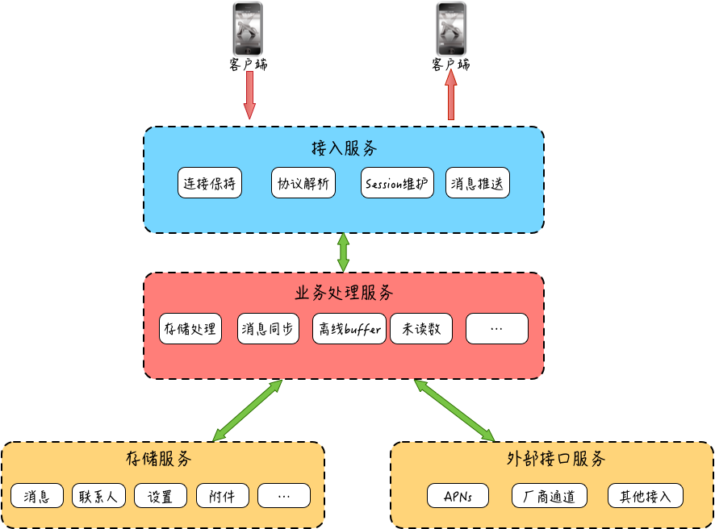
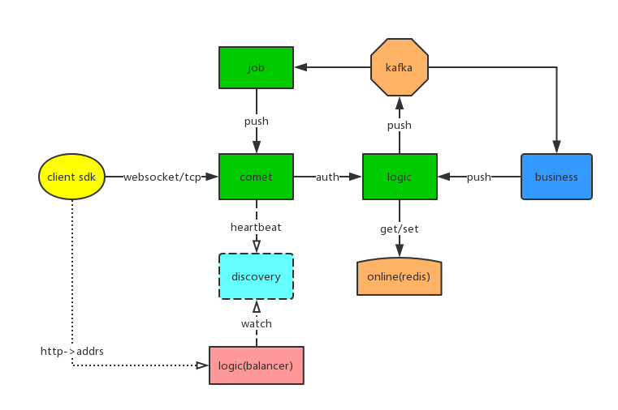
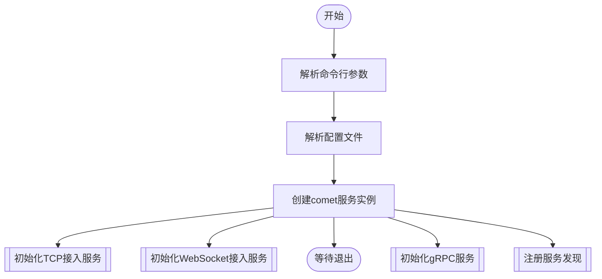
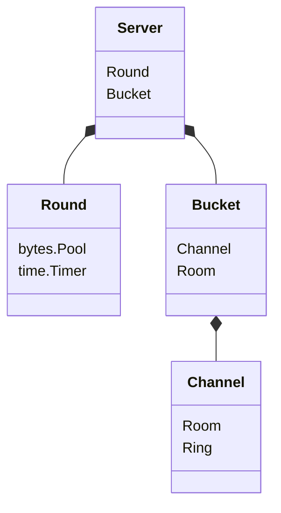

+++
title = '高并发实操：从一个IM系统开始'
date = 2023-11-26T22:59:34+08:00

tags = [
  "goim",
  "im",
  "Kafka",
  "Raft"
]
categories = [
  "Golang",
  "高并发"
]
+++

# 高并发实操：从一个IM系统开始

## 简述

近期面试了一些公司，很明显地感受到了跟“高并发”的实际业务接触得太少带来的短板。
因此在此开一篇博客记录下以开源的GOIM为切入点，系统性地学习一下IM系统，补一下“高并发”短板。

之所以选择IM(Instant Messaging)系统作为学习目标，有以下几个原因：
* **典型应用场景**： IM系统通常需要处理大量用户的同时在线和实时交互，是高并发技术的典型应用场景。
* **场景复杂**： 需要考虑网络场景下的多端数据同步，并涉及到多种通信类型数据需要处理。
* **广泛适用**： 几乎所有的社交、商业和企业应用都集成了即时聊天功能，掌握相关技术可以提高我在多个领域的竞争力。

对于IM技术，其实不仅限于聊天，所有需要“实时”互动的高实时性的场景，都需要IM技术。例如：直播、在线诊疗、物联网、导航等。

## 架构与特性

而从开发者角度来看，系统主要有几个部分：客户端、接入服务、业务处理服务、存储服务和外部接口服务。





### 架构分层
#### 客户端
客户端一般是用户用于收发消息的终端设备，内置的客户端程序和服务端进行网络通信，用来承载用户的互动请求和消息接收功能。我们可以把客户端想象为邮局业务的前台，它负责把你的信收走，放到传输管道中。

#### 接入服务
接入服务可以认为是服务端的门户，为客户端提供消息收发的出入口。发送的消息先由客户端通过网络给到接入服务，然后再由接入服务递交到业务层进行处理。

接入服务主要有四块功能：连接保持、协议解析、Session 维护和消息推送。


#### 业务处理服务
业务处理服务是真正的消息业务逻辑处理层，比如消息的存储、未读数变更、更新最近联系人等，这些内容都是业务处理的范畴。


#### 存储服务
这个比较好理解，账号信息、关系链，以及消息本身，都需要进行持久化存储。

#### 外部接口服务
由于手机操作系统的限制，以及资源优化的考虑，大部分 App 在进程关闭，或者长时间后台运行时，App 和 IM 服务端的连接会被手机操作系统断开。这样当有新的消息产生时，就没法通过 IM 服务再触达用户，因而会影响用户体验。为了让用户在 App 未打开时，或者在后台运行时，也能接收到新消息，我们会将消息给到第三方外部接口服务，来通过手机操作系统自身的公共连接服务来进行操作系统级的“消息推送”，通过这种方式下发的消息一般会在手机的“通知栏”对用户进行提醒和展示。

### 为什么这么分层？
> "计算机科学领域的任何问题都可以通过增加一个简介的中间层来解决"

在软件开发中最常见的就是分层架构，他可以让我们分离关注点，让每层关注特定功能，并且隔离变化。在这里虽然业务层和接入服务层都是跟消息收发相关，但是业务处理服务可能会经常性的变动，因此分离业务处理服务和接入服务，可以保障连接层的稳定性。同时，分离关注点后，相关开发人员可以更聚焦特定功能实现，而不用考虑其他层的处理及稳定性。

### 特性

#### 实时性
对于一个实时消息系统，“实时”二字很好地表达了这个系统的基本要求。

#### 可靠性
“实时性”是即时消息被广泛应用于各种社交、互动领域的基本前置条件，那么消息的可靠性则是实时消息服务可以“被信赖”的另一个重要特性。主要体现在：
* 不丢消息
* 不重复

#### 一致性
同一条消息，在多人、多终端需要保证展现顺序的一致性。

#### 安全性
由于即时消息被广泛应用于各种私密社交和小范围圈子社交，因此用户对于系统的隐私保护能力要求也相对较高。
从系统使用安全性的角度来看，首先是要求“数据传输安全”，其次是要求“数据存储安全”，最后就是“消息内容安全”。

### IM系统基础信息总结
以上就是一个IM系统的大致介绍，通过这些内容大致能搞清楚什么是IM系统以及常见的架构及特征。接下来我将结合“高并发”话题，定点扩充内容及实操。
从上述架构中的服务接入层以及存储层结合四大特性中的实时性、可靠性及一致性进行展开学习。


## 如何实现服务接入层

### 长连接
现阶段业界在设备接入层，通常采用在IM服务端的网关服务和消息收发设备之间维护一条TCP长连接或WebSocket长连接的模式，采用TCP/WebSocket全双工的能力，能够同时收发数据，从而实现真正的“边缘触发”的能力。

在HTML5的WebSocket技术出现之前，web端只能通过HTTP长轮询或短轮询的方式来“拉”数据，这种模式对服务端资源要求比较高，因为要承担海量高频的QPS。

这些基于 TCP 长连接的通信协议，在用户上线连接时，会在服务端维护好连接到服务器的用户设备和具体 TCP 连接的映射关系，通过这种方式服务端也能通过这个映射关系随时找到对应在线的用户的客户端，而且这个长连接一旦建立，就一直存在，除非网络被中断。

因为“长连接”方式相比“短连接轮询”，不仅能节约不必要的资源开销，最重要的是能够通过“服务端推送”，提供更加实时的消息下发。

同样，对于发送方来说，如果发送消息也能通过“长连接”通道把消息给到 IM 服务端，相对于短连接方式，也能省略 TCP 握手和 TLS 握手的几个 RTT 的时间开销，在用户体验和实时性上也会更好。


### 如何维护长连接

“长连接”方式给我们带来了众多好处，那么要让消息通过“长连接”实现可靠投递，最重要的环节就在于如何维护好这个“长连接”。

由于这个“长连接”底层使用的 TCP 连接并不是一个真正存在的物理连接，实际上只是一个无感知的虚拟连接，中间链路的断开连接的两端不会感知到，因此维护好这个“长连接”一个关键的问题在于能够让这个“长连接”能够在中间链路出现问题时，让连接的两端能快速得到通知，然后通过“重连”来重新建立新的可用连接，从而让我们这个“长连接”一直保持“高可用”状态。

这个能够“快速”“不间断”识别连接可用性的机制，被称为“心跳机制”。“心跳机制”通过持续的往连接上发送“模拟数据”来试探连接的可用性，同时也让我们的连接在没有真正业务数据收发的时候，也持续有数据流通，而不会被中间的网络运营商以为连接已经没有在使用而把连接切断。

### goim源码解析
有了上面知识做背景，来看一下 GOIM是如何实现上述目标的。

从架构图可以看出，GOIM也是接入层和业务逻辑层分离的，comet组建负责长连接的接入与维护，非常容易扩展，可以开启多个comet节点，前端接入可以使用LVS或者DNS来做转发。

#### comet组件目录结构
```bash
internal/comet
├── bucket.go   #Bucket结构体，用于保存维护当前消息通道和房间信息
├── channel.go  #Channel结构体，用户长连接的抽象，对conn做了一些封装，并使用了Ring buffer保存消息
├── conf
│   └── conf.go
├── errors
│   └── errors.go
├── grpc
│   └── server.go
├── operation.go    
├── ring.go 
├── room.go     #Room结构体，对应一个房间并存储房间相关信息以及Channel。
├── round.go    #Round结构体，申请用于Reader Buffer、Writer Buffer、Timer的bytes.Pool。用于减少内存频繁申请。
├── server.go   
├── server_tcp.go   #处理TCP长连接逻辑
├── server_websocket.go #处理websocket长连接逻辑
└── whitelist.go
```
#### `goim/cmd/comet/main.go`源码
```go
func main() {
	flag.Parse()
	if err := conf.Init(); err != nil {
		panic(err)
	}
	rand.Seed(time.Now().UTC().UnixNano())
	runtime.GOMAXPROCS(runtime.NumCPU())
	println(conf.Conf.Debug)
	log.Infof("goim-comet [version: %s env: %+v] start", ver, conf.Conf.Env)
	// 注册服务发现，使用的bilibili开源的discovery
	dis := naming.New(conf.Conf.Discovery)
	resolver.Register(dis)
	// 启动一个comet服务
	srv := comet.NewServer(conf.Conf)
	if err := comet.InitWhitelist(conf.Conf.Whitelist); err != nil {
		panic(err)
	}
	if err := comet.InitTCP(srv, conf.Conf.TCP.Bind, runtime.NumCPU()); err != nil {
		panic(err)
	}
	if err := comet.InitWebsocket(srv, conf.Conf.Websocket.Bind, runtime.NumCPU()); err != nil {
		panic(err)
	}
	if conf.Conf.Websocket.TLSOpen {
		if err := comet.InitWebsocketWithTLS(srv, conf.Conf.Websocket.TLSBind, conf.Conf.Websocket.CertFile, conf.Conf.Websocket.PrivateFile, runtime.NumCPU()); err != nil {
			panic(err)
		}
	}
    ...
```
由上面源码可以得到comet启动流程：

由此可以看出，comet 服务启动比较关键，由于结构体及方法过多，此处就不一一展开。挑选几个重要结构体结合“高并发”目标来具体分析一下。接下来看一下comet Server结构体具体代码。

#### `goim/internal/comet/server.go`分析
```go
// Server is comet server.
type Server struct {
    // 配置信息
	c         *conf.Config
    // 根据配置信息定义了一个round结构体，用于连接轮询，获取Writer/Reader/Timer，拆分大型锁，减少竞争。从而提高并发性能。
	round     *Round    // accept round store
    //用于存储Room和Channel等数据
	buckets   []*Bucket // subkey bucket
	bucketIdx uint32

    // 服务ID，用于区分不同comet节点
	serverID  string
    //logicRpcClient 创建单个连接，避免资源浪费
	rpcClient logic.LogicClient
}
```
可以看出，Server中使用了大量自定义的数据结构，省略掉原生数据类型后，大致如下：

其中比较常用到的自定义对象有:
* `bytes.Pool`
* `time.Timer`
* `comet.Bucket`
* `comet.Room`
* `comet.Channel`

bytes.Pool的作用是构建一个内存池，申请一个大的内存分割给需要Buffer的对象使用，避免其他对象单独申请Buffer在高并发场景下对GC的压力。

time.Timer 重新实现了一个**time.Timer**，目的也是拆分锁，减少高并发场景下，竞争全局锁的情况。在使用中主要用来发送心跳维护长连接状态。

comet.Bucket是维护当前消息通道和房间的信息，有独立的 Goroutine 和 读写锁优化(一个comet服务有多个Bucket)，用户可以自定义配置对应的 buckets 数量，在大并发业务上尤其明显。

comet.Room维护了的房间的通道 Channel, 推送消息进行了合并写，减少小数据浪费系统调用开销。

comet.Channel是对用户连接的抽象，代表一个连接通道。其中Writer/Reader 就是对conn的封装，cliProto是一个Ring Buffer，用于存储Room广播或直接发送过来的消息体。使用定长的Ring Buffer可以提高内存使用效率，同时避免频繁的内存释放和分配。

### 总结
从开源的goim以及IM系统本身的特点来看，im系统接入层服务的主要挑战是在维护大量的长连接。
而现有IM系统，包括开源的goim，主要采取的方式有：
* 设计分布式系统，使用HTTPDNS做负载均衡，并且接入节点尽可能地离用户近
* 应用层心跳机制，连接保活，降低服务端连接开销。
* Go语言开发层面
  * 优化内存使用，使用资源管理池进行内存管理
  * 通信相互独立，彼此不受干扰
  * 拆分锁，减少资源锁竞争
  * 并发数一定要可控，避免爆发
  * 小对象合并，一次性分配内存
  * 缓存区一次性分配够，并适减少冗余
  * 调用栈避免申请过多临时对象
  * 拆分大函数，减少触发栈扩容
  * 网络模型优化，使用epoll


### 待改进
goim由于是bilibili员工开源的项目，使用的服务发现是bilibili/discovery，会带来额外的学习成本。同时使用的消息中间件为kafka，耦合到代码中，对技术栈选择上有一定限制。

参考文章：
[如何设计一个亿级消息量的 IM 系统](https://xie.infoq.cn/article/19e95a78e2f5389588debfb1c)

[万亿级调用系统：微信序列号生成器架构设计及演变](https://mp.weixin.qq.com/s/JqIJupVKUNuQYIDDxRtfqA)

[一个海量在线用户即时通讯系统（IM）的完整设计](https://mp.weixin.qq.com/s?__biz=MzI1ODY0NjAwMA==&amp;mid=2247483756&amp;idx=1&amp;sn=a8e3303bc573b1acaf9ef3862ef89bdd&amp;chksm=ea044bf3dd73c2e5dcf2c10202c66d6143ec866205e9230f974fbc0b0be587926699230b6b18&amp;scene=21#wechat_redirect)

[goim](https://github.com/Terry-Mao/goim/blob/master/README.md)

[美图三年优化总结：Golang 实现单机百万长连接服务](https://www.infoq.cn/article/dFLJtPUs3G8SNikNty7o)