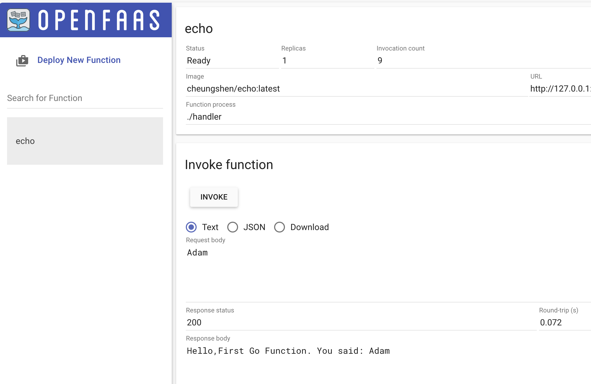

+++
title = 'Openfaas：初体验'
date = 2022-08-15T12:12:06+08:00

tags = [
  "Serverless",
  "云原生",
  "faas",
  "openfaas",
  "Docker"
]
categories = [
  "Serverless",
  "K8s"
]
+++


# Openfaas初体验

## 预备环境

### Kubernetes
Kubernetes（通常称为 K8s）是一个开源平台，用于自动化容器化应用程序的部署、扩展和管理。最初由 Google 设计并捐赠给 Cloud Native Computing Foundation（CNCF）进行维护，它已经成为容器编排技术中最流行的选择之一。

#### Minikube
minikube 在 macOS、Linux 和 Windows 上实现了本地 Kubernetes 集群。minikube 的主要目标是成为本地 Kubernetes 应用程序开发的最佳工具，并支持所有适合的 Kubernetes 功能。

##### 安装

1. 安装Minikube可执行文件
从[release页面](https://github.com/kubernetes/minikube/releases/latest)下载指定版本minikube。
解压到可访问的路径下:
* linux: sudo install minikube-linux-amd64 /usr/local/bin/minikube
* macos: sudo install minikube-darwin-amd64 /usr/local/bin/minikube
* windows: $PATH

2. 安装虚拟化环境
   1. linux建议：[Docker](https://minikube.sigs.k8s.io/docs/drivers/docker/)，[KVM2](https://minikube.sigs.k8s.io/docs/drivers/kvm2/)
   2. macos建议：[Docker](https://minikube.sigs.k8s.io/docs/drivers/docker/)
   3. windows建议：[Hyper-V](https://minikube.sigs.k8s.io/docs/drivers/hyperv/)，[Docker](https://minikube.sigs.k8s.io/docs/drivers/docker/)
3. 启动 Minikube
```bash
minikube start
```
额外参数:
* --driver=docker，驱动环境
* --image-repository=registry.cn-hangzhou.aliyuncs.com/google_containers，镜像仓库地址，可自定义本地镜像仓库
* --image-mirror-country=cn, 镜像仓库国家区域，无魔法网络可以设置为cn。但是测试没什么效果

4. 安装kubectl
```bash
minikube kubectl
```

#### 测试kubernetes集群

1. 检查集群状态
```bash
❯ kubectl cluster-info
Kubernetes control plane is running at https://127.0.0.1:57774
CoreDNS is running at https://127.0.0.1:57774/api/v1/namespaces/kube-system/services/kube-dns:dns/proxy

To further debug and diagnose cluster problems, use 'kubectl cluster-info dump'
```

2. 获取节点状态
```bash
❯ kubectl get nodes

NAME       STATUS   ROLES           AGE   VERSION
minikube   Ready    control-plane   67m   v1.28.3
```

3. 检查Pods的状态
```bash
❯ kubectl get pods -n kube-system

NAME                               READY   STATUS    RESTARTS   AGE
coredns-5dd5756b68-qzz4f           1/1     Running   0          68m
etcd-minikube                      1/1     Running   0          68m
kube-apiserver-minikube            1/1     Running   0          68m
kube-controller-manager-minikube   1/1     Running   0          68m
kube-proxy-zl2pw                   1/1     Running   0          68m
kube-scheduler-minikube            1/1     Running   0          68m
storage-provisioner                1/1     Running   0          68m
```

4. 查看srv
```bash
❯ kubectl get svc

NAME         TYPE        CLUSTER-IP   EXTERNAL-IP   PORT(S)   AGE
kubernetes   ClusterIP   10.96.0.1    <none>        443/TCP   68
```

5. 运行一个测试 Pod
```bash
❯ kubectl run nginx --image=nginx --port=80
pod/nginx created

❯ kubectl get pods
NAME    READY   STATUS    RESTARTS   AGE
nginx   1/1     Running   0          111s
```

6. 暴露服务并测试
```bash
❯ kubectl expose pod nginx --type=NodePort --name=nginx-service
service/nginx-service exposed

❯ kubectl get svc nginx-service
NAME            TYPE       CLUSTER-IP      EXTERNAL-IP   PORT(S)        AGE
nginx-service   NodePort   10.111.90.107   <none>        80:31572/TCP   5s
```

7. 查看组件状态
```bash
❯ kubectl get componentstatuses

Warning: v1 ComponentStatus is deprecated in v1.19+
NAME                 STATUS    MESSAGE   ERROR
etcd-0               Healthy   ok
scheduler            Healthy   ok
controller-manager   Healthy   ok
```


### Helm
Helm 是 Kubernetes 的一个包管理工具，类似于 Linux 系统中的 apt 或 yum。它被设计用于简化 Kubernetes 应用程序的部署和管理。Helm 使用一个包格式称为“图表”（charts），它是一个预先配置好的资源集合，可以作为一个单元进行部署。

#### 三大概念

* Chart 代表着 Helm 包。它包含在 Kubernetes 集群内部运行应用程序，工具或服务所需的所有资源定义。你可以把它看作是 Homebrew formula，Apt dpkg，或 Yum RPM 在Kubernetes 中的等价物。

* Repository（仓库） 是用来存放和共享 charts 的地方。它就像 Perl 的 CPAN 档案库网络 或是 Fedora 的 软件包仓库，只不过它是供 Kubernetes 包所使用的。

* Release 是运行在 Kubernetes 集群中的 chart 的实例。一个 chart 通常可以在同一个集群中安装多次。每一次安装都会创建一个新的 release。以 MySQL chart为例，如果你想在你的集群中运行两个数据库，你可以安装该chart两次。每一个数据库都会拥有它自己的 release 和 release name。

在了解了上述这些概念以后，我们就可以这样来解释 Helm：
Helm 安装 charts 到 Kubernetes 集群中，每次安装都会创建一个新的 release。你可以在 Helm 的 chart repositories 中寻找新的 chart。

#### 命令
* 'helm search'：查找 Charts
  * helm search hub 从 Artifact Hub 中查找并列出 helm charts。 Artifact Hub中存放了大量不同的仓库。
  * helm search repo 从你添加（使用 helm repo add）到本地 helm 客户端中的仓库中进行查找。该命令基于本地数据进行搜索，无需连接互联网。
* 'helm install'：安装一个 helm 包
* 'helm uninstall'：卸载 release
* 'helm upgrade' 和 'helm rollback'：升级 release 和失败时恢复
  * helm upgrade -f panda.yaml happy-panda bitnami/wordpress 只会更新自上次发布以来发生了更改的内容
  * helm rollback [RELEASE] [REVISION] 命令回滚到之前的发布版本
* 'helm repo'：使用仓库
  * helm repo list 来查看配置的仓库
  * helm repo add 来添加新的仓库
* 'helm create'：创建你自己的 charts
* other
  * helm show values 可以查看 chart 中的可配置选项
  * helm get values 命令来看看配置值是否真的生效了
  * helm status 来追踪 release 的状态，或是重新读取配置信息
  * helm list 命令看到当前部署的所有 release

#### 安装
##### 用二进制版本安装
每个Helm 版本都提供了各种操作系统的二进制版本，这些版本可以手动下载和安装。
1. 下载[需要的版本](https://github.com/helm/helm/releases)
2. 解压(tar -zxvf helm-v3.0.0-linux-amd64.tar.gz)
3. 在解压目录中找到helm程序，移动到需要的目录中(mv linux-amd64/helm /usr/local/bin/helm)

##### 使用脚本安装
Helm现在有个安装脚本可以自动拉取最新的Helm版本并在[本地安装](https://raw.githubusercontent.com/helm/helm/main/scripts/get-helm-3)。
您可以获取这个脚本并在本地执行。它良好的文档会让您在执行之前知道脚本都做了什么。
```bash
$ curl -fsSL -o get_helm.sh https://raw.githubusercontent.com/helm/helm/main/scripts/get-helm-3
$ chmod 700 get_helm.sh
$ ./get_helm.sh
```
如果想直接执行安装，运行`curl https://raw.githubusercontent.com/helm/helm/main/scripts/get-helm-3 | bash`。

##### 通过包管理器安装
Helm社区提供了通过操作系统包管理器安装Helm的方式。但Helm项目不支持且不认为是可信的第三方。

**使用Homebrew (macOS)**
Helm社区成员贡献了一种在Homebrew构建Helm的方案，这个方案通常是最新的。

```bash
brew install helm
```

**使用Apt (Debian/Ubuntu)**
Helm社区成员贡献了针对Apt的一个 [Helm包](https://helm.baltorepo.com/stable/debian/)，包通常是最新的。
```bash
curl https://baltocdn.com/helm/signing.asc | gpg --dearmor | sudo tee /usr/share/keyrings/helm.gpg > /dev/null
sudo apt-get install apt-transport-https --yes
echo "deb [arch=$(dpkg --print-architecture) signed-by=/usr/share/keyrings/helm.gpg] https://baltocdn.com/helm/stable/debian/ all main" | sudo tee /etc/apt/sources.list.d/helm-stable-debian.list
sudo apt-get update
sudo apt-get install helm
```

**使用源码Source (Linux, macOS)**
从源码构建Helm的工作要稍微多一点，但如果你想测试最新（预发布）的Helm版本，这是最好的方式。

您必须有可用的Go环境。
```bash
$ git clone https://github.com/helm/helm.git
$ cd helm
$ make
```


### arkade
获取 arkade
```bash
# For MacOS / Linux:
curl -SLsf https://get.arkade.dev/ | sudo sh

# For Windows (using Git Bash)
curl -SLsf https://get.arkade.dev/ | sh
```

### faas-cli
```bash
arkade get faas-cli
```

## 安装Openfaas

### 通过arkade安装

```bash
❯ arkade install openfaas
Using Kubeconfig: /Users/libao/.kube/config
[Warning] unable to create secret basic-auth, may already exist: error: failed to create secret secrets "basic-auth" already exists
Client: x86_64, Darwin
2023/12/05 18:05:29 User dir established as: /Users/libao/.arkade/
"openfaas" has been added to your repositories

Hang tight while we grab the latest from your chart repositories...
...Successfully got an update from the "openfaas" chart repository
...Successfully got an update from the "bitnami" chart repository
Update Complete. ⎈Happy Helming!⎈

VALUES values.yaml
Command: /Users/libao/.arkade/bin/helm [upgrade --install openfaas openfaas/openfaas --namespace openfaas --values /var/folders/tp/d3cfqxnd15z9slwv0d096hm80000gn/T/charts/openfaas/values.yaml --set clusterRole=false --set gateway.directFunctions=false --set dashboard.enabled=false --set queueWorker.maxInflight=1 --set autoscaler.enabled=false --set dashboard.publicURL=http://127.0.0.1:8080 --set operator.create=false --set openfaasImagePullPolicy=IfNotPresent --set faasnetes.imagePullPolicy=Always --set basicAuthPlugin.replicas=1 --set gateway.replicas=1 --set ingressOperator.create=false --set basic_auth=true --set queueWorker.replicas=1 --set serviceType=NodePort]
Release "openfaas" has been upgraded. Happy Helming!
NAME: openfaas
LAST DEPLOYED: Tue Dec  5 18:05:40 2023
NAMESPACE: openfaas
STATUS: deployed
REVISION: 3
TEST SUITE: None
NOTES:
To verify that openfaas has started, run:

  kubectl -n openfaas get deployments -l "release=openfaas, app=openfaas"

To retrieve the admin password, run:

  echo $(kubectl -n openfaas get secret basic-auth -o jsonpath="{.data.basic-auth-password}" | base64 --decode)
=======================================================================
= OpenFaaS has been installed.                                        =
=======================================================================

# Get the faas-cli
curl -SLsf https://cli.openfaas.com | sudo sh

# Forward the gateway to your machine
kubectl rollout status -n openfaas deploy/gateway
kubectl port-forward -n openfaas svc/gateway 8080:8080 &

# If basic auth is enabled, you can now log into your gateway:
PASSWORD=$(kubectl get secret -n openfaas basic-auth -o jsonpath="{.data.basic-auth-password}" | base64 --decode; echo)
echo -n $PASSWORD | faas-cli login --username admin --password-stdin

faas-cli store deploy figlet
faas-cli list

# For Raspberry Pi
faas-cli store list \
 --platform armhf

faas-cli store deploy figlet \
 --platform armhf

# Find out more at:
# https://github.com/openfaas/faas

🚀 Speed up GitHub Actions/GitLab CI + reduce costs: https://actuated.dev
```

### 检查服务是否正常
```bash
❯ kubectl -n openfaas get deployments -l "release=openfaas, app=openfaas"
NAME           READY   UP-TO-DATE   AVAILABLE   AGE
alertmanager   1/1     1            1           1m
gateway        1/1     1            1           1m
nats           1/1     1            1           1m
prometheus     1/1     1            1           1m
queue-worker   1/1     1            1           1m
```

### 转发服务到主机端口

为了方便使用faas-cli操作，将网关端口转发到本地进行操作：
```bash
❯ kubectl port-forward svc/gateway 8080:8080 -n openfaas
Forwarding from 127.0.0.1:8080 -> 8080
Forwarding from [::1]:8080 -> 8080
```

## 创建一个函数服务

### 拉取openfaas模版
OpenFaaS CLI 内置了一个模板引擎，可以使用给定的编程语言创建新函数。其工作方式是从当前工作文件夹中的位置读取模板列表。./template

因此在创建新函数之前，请确保通过模板存储库从 GitHub 拉取官方 OpenFaaS 语言模板。
#### 拉取最新模版
```bash
❯ faas-cli template pull
Fetch templates from repository: https://github.com/openfaas/templates.git at
2023/12/05 18:30:55 Attempting to expand templates from https://github.com/openfaas/templates.git
2023/12/05 18:30:57 Cannot overwrite the following 17 template(s): [bun csharp dockerfile go java11 java11-vert-x node node14 node16 node17 node18 php7 php8 python python3 python3-debian ruby]
2023/12/05 18:30:57 Fetched 0 template(s) : [] from https://github.com/openfaas/templates.git
```
#### 查看模版目录内容
```bash
❯ tree template -L 1
template
├── bun
├── csharp
├── dockerfile
├── go
├── java11
├── java11-vert-x
├── node
├── node14
├── node16
├── node17
├── node18
├── php7
├── php8
├── python
├── python3
├── python3-debian
└── ruby

18 directories, 0 files
```
#### 查看语言模版列表
```bash
❯ faas-cli new --list
Languages available as templates:
- bun
- csharp
- dockerfile
- go
- java11
- java11-vert-x
- node
- node14
- node16
- node17
- node18
- php7
- php8
- python
- python3
- python3-debian
- ruby
```
可以看到`faas-cli new --list`命令和模版文件内容是一一对应的，因此要保证执行命令处于正确目录下。

### 创建第一个Function

创建一个go语言的Function
```bash
❯ faas-cli new echo --lang go
Folder: echo created.
  ___                   _____           ____
 / _ \ _ __   ___ _ __ |  ___|_ _  __ _/ ___|
| | | | '_ \ / _ \ '_ \| |_ / _` |/ _` \___ \
| |_| | |_) |  __/ | | |  _| (_| | (_| |___) |
 \___/| .__/ \___|_| |_|_|  \__,_|\__,_|____/
      |_|


Function created in folder: echo
Stack file written: echo.yml

Notes:
Warning: this classic Go template has been DEPRECATED and
is being maintained for backwards compatibility reasons only.

Use the golang-middleware template instead, learn more at:

See more: https://docs.openfaas.com/cli/templates
```
操作成功后，当前目录下会生成以下文件：
```bash
❯ tree . -L 2
.
├── echo
│   ├── go.mod
│   └── handler.go
├── echo.yml
...
```
编辑echo/handler.go为下面内容：
```go
package function

import (
	"fmt"
)

// Handle a serverless request
func Handle(req []byte) string {
	return fmt.Sprintf("Hello,First Go Function. You said: %s", string(req))
}
```

调用测试
```bash
❯ echo "Adam"|faas-cli invoke echo -g http://127.0.0.1:58959
Hello,First Go Function. You said: Adam
```
使用WebUI调用



## 问题汇总

### Minikube网络问题
可以使用带魔法网络环境的机器进行镜像下载，然后使用离线模式部署。这里可以使用Github Action进行镜像拉取。可以参考[hub-mirror](https://github.com/togettoyou/hub-mirror)项目。


### openfaas部署问题
* **Not Ready**: openfaas部署 Function后，默认会根据function.yml中的配置拉取镜像，如果私有服务需要提前faas-cli build的镜像上传到openfaas服务能访问到的docker registry中，否则会出现拉取镜像失败，一直处于`Not Ready`
* 访问远程openfaas服务时，可以通过`faas-cli -g http://remote:port`进行操作。

### 使用Minikube或Kind时，Dockr环境问题
使用Dind类似的技术的时候，k8s集群运行在容器内部，此时运行的k8s应用需要额外的操作才能在外部访问。
例如`minikube service`，将容器内部k8s的服务转发到主机。
```bash
❯ minikube service  --all -n openfaas
|-----------|--------------|-------------|--------------|
| NAMESPACE |     NAME     | TARGET PORT |     URL      |
|-----------|--------------|-------------|--------------|
| openfaas  | alertmanager |             | No node port |
|-----------|--------------|-------------|--------------|
😿  service openfaas/alertmanager 没有 NodePort
|-----------|---------|-------------|--------------|
| NAMESPACE |  NAME   | TARGET PORT |     URL      |
|-----------|---------|-------------|--------------|
| openfaas  | gateway |             | No node port |
|-----------|---------|-------------|--------------|
😿  service openfaas/gateway 没有 NodePort
|-----------|------------------|-------------|---------------------------|
| NAMESPACE |       NAME       | TARGET PORT |            URL            |
|-----------|------------------|-------------|---------------------------|
| openfaas  | gateway-external | http/8080   | http://192.168.49.2:31112 |
|-----------|------------------|-------------|---------------------------|
|-----------|------|-------------|--------------|
| NAMESPACE | NAME | TARGET PORT |     URL      |
|-----------|------|-------------|--------------|
| openfaas  | nats |             | No node port |
|-----------|------|-------------|--------------|
😿  service openfaas/nats 没有 NodePort
|-----------|------------|-------------|--------------|
| NAMESPACE |    NAME    | TARGET PORT |     URL      |
|-----------|------------|-------------|--------------|
| openfaas  | prometheus |             | No node port |
|-----------|------------|-------------|--------------|
😿  service openfaas/prometheus 没有 NodePort
🏃  为服务 alertmanager 启动隧道。
🏃  为服务 gateway 启动隧道。
🏃  为服务 gateway-external 启动隧道。
🏃  为服务 nats 启动隧道。
🏃  为服务 prometheus 启动隧道。
|-----------|------------------|-------------|------------------------|
| NAMESPACE |       NAME       | TARGET PORT |          URL           |
|-----------|------------------|-------------|------------------------|
| openfaas  | alertmanager     |             | http://127.0.0.1:58955 |
| openfaas  | gateway          |             | http://127.0.0.1:58957 |
| openfaas  | gateway-external |             | http://127.0.0.1:58959 |
| openfaas  | nats             |             | http://127.0.0.1:58961 |
| openfaas  | prometheus       |             | http://127.0.0.1:58963 |
|-----------|------------------|-------------|------------------------|
🎉  正通过默认浏览器打开服务 openfaas/alertmanager...
🎉  正通过默认浏览器打开服务 openfaas/gateway...
🎉  正通过默认浏览器打开服务 openfaas/gateway-external...
🎉  正通过默认浏览器打开服务 openfaas/nats...
🎉  正通过默认浏览器打开服务 openfaas/prometheus...
❗  因为你正在使用 darwin 上的 Docker 驱动程序，所以需要打开终端才能运行它。
```

### K8s应用服务问题排查
`kubectl get events` 是一个用于获取 Kubernetes 集群中事件（events）的命令。事件是 Kubernetes 集群中发生的各种事情的记录，包括创建、更新、删除资源对象、调度问题、节点故障、容器启动和停止等等。这些事件对于监视和故障排除非常有用，可以帮助您了解集群中发生的事情，以便及时采取行动。
例如： `kubectl get events --sort-by=.metadata.creationTimestamp -n openfaas-fn`


### 自建docker registy问题
由于openfaas function 部署过后，默认会从仓库拉取部署时yml指定的镜像，而为了代码安全一般是自建私有docker registy进行管理。
在新版本docker中，默认使用https进行镜像拉取，因此需要为docker registy配置相关证书(一般为自签)。
假设docker registry节点IP为192.168.101.4，配置流程如下：
* 生成自签名证书

创建配置文件`sans.cnf`，增加SANs段
```conf
[ req ]
default_bits       = 2048
prompt             = no
default_md         = sha256
req_extensions     = req_ext
distinguished_name = dn

[ dn ]
C=CN
ST=Si Chuan
L=Cheng Du
O=Devops
OU=Adam
CN=192.168.101.4

[ req_ext ]
subjectAltName = @alt_names

[ alt_names ]
IP.1    = 192.168.101.4
DNS.1   = 192.168.101.4
```

```bash
#创建certs目录
mkdir certs
#进入目录
cd certs
#生成密钥
❯ openssl req -new -out domain.csr -newkey rsa:2048 -nodes -keyout domain.key -config sans.cnf
#使用配置生成签名证书
❯ openssl x509 -req -days 365 -in domain.csr -signkey domain.key -out domain.crt -extfile sans.cnf -extensions req_ext
```

* 创建一个存储Docker Registry的目录(可选)：
```bash
mkdir registry-data
```

* 配置Docker Registry：
```yml
version: 0.1
log:
  fields:
    service: registry
storage:
  delete:
    enabled: true
  cache:
    blobdescriptor: inmemory
  filesystem:
    rootdirectory: /var/lib/registry
http:
  addr: :5000
  headers:
    X-Content-Type-Options: [nosniff]
  tls:
    certificate: /certs/domain.crt
    key: /certs/domain.key
```
请确保将 `certificate` 和 `key` 的路径设置为您生成的自签名证书的路径。

* 运行Docker Registry：
```bash
docker run -d -p 5000:5000 --restart=always --name registry -v "$(pwd)"/registry-data:/var/lib/registry -v "$(pwd)"/certs:/certs -v "$(pwd)"/config.yml:/etc/docker/registry/config.yml registry:2
```

* 配置Docker客户端：
在需要访问docker registry的Docker客户端上，将Docker配置为信任自签名证书。
将自签名证书复制到Docker客户端的/etc/docker/certs.d/192.168.101.4:5000 目录下（如果目录不存在，请创建它）：
```bash
sudo mkdir -p /etc/docker/certs.d/192.168.101.4:5000
sudo cp certs/domain.crt /etc/docker/certs.d/192.168.101.4:5000/ca.crt
```

* 重启docker服务
```bash
sudo systemctl restart docker
```