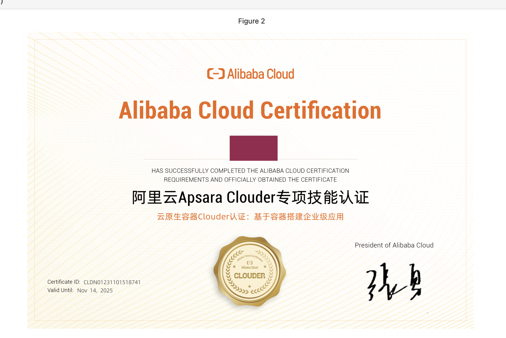
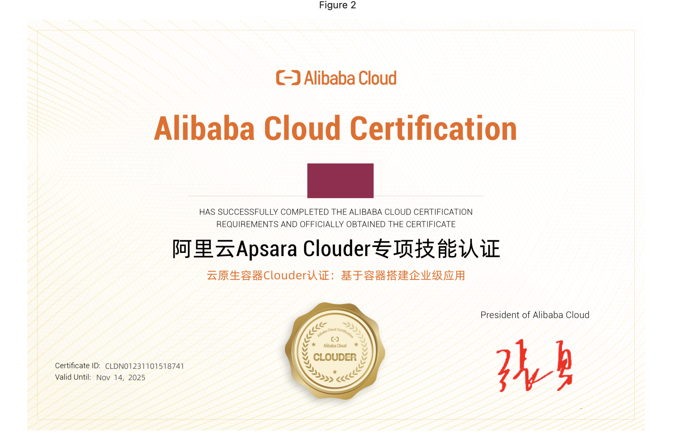
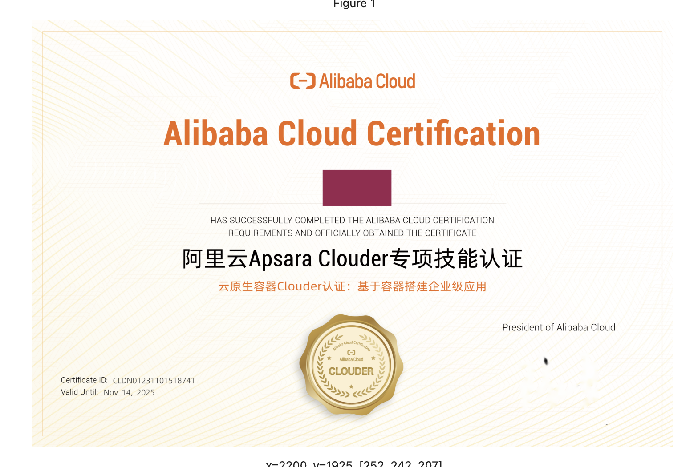
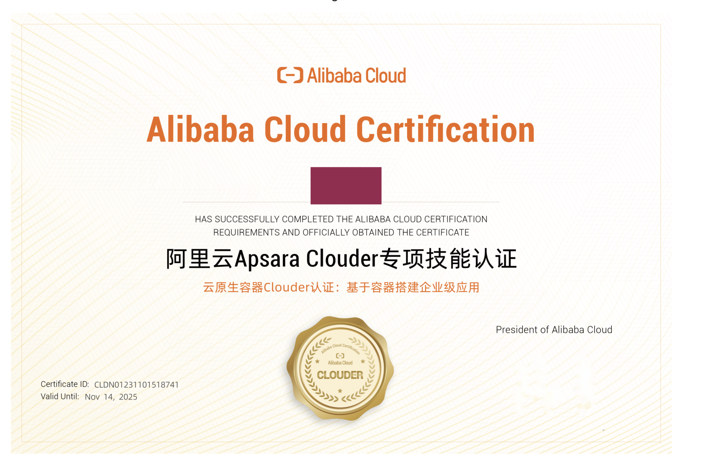

+++
title = '使用opencv去水印'
date = 2023-12-02T17:25:03+08:00

tags = [
  "Opencv",
  "python"
]
categories = [
  "Python",
  "图像处理"
]
+++

# 使用opencv去水印
最近有朋友让我帮忙去几个视频水印，答应下来后准备开工，但是我打开电脑上却发现Pr早就被自己卸载掉了，在网盘里面也没有找到对应安装包，遂考虑使用编码的方式实现去水印。

经查阅资料，opencv提供了inpainting函数可以对指定区域进行修复。

## 获取mask

获取mask可以有多种实现方式

1. 使用笔迹涂抹，大多数在线处理平台采取这种方式，优点是实现简单。
2. 使用内容感知(区域生长算法region_grow)，优点是使用方便，缺点是背景要求差异大。
3. 使用SAM进行分割，优点是应用场景广，缺点是算力要求高。

## 修补

效果如下:
原图

点击签名区域生成mask

调用修复函数

修复效果尚可，但是边缘存在部分未修复的区域，我们可以调用dilate对掩模进行扩张，然后再调用修复函数。
效果如下：

完美～

## 视频去水印思路
视频去水印跟图片去水印思路一致，将视频按帧处理即可，不过只能处理固定水印，非固定水印可以提前获取到水印形状及位置，然后按帧处理进行模版搜索修补即可。
